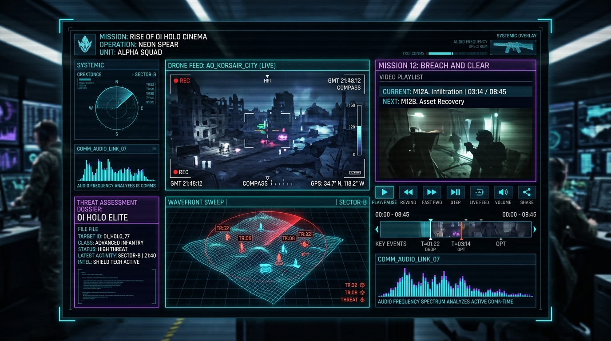
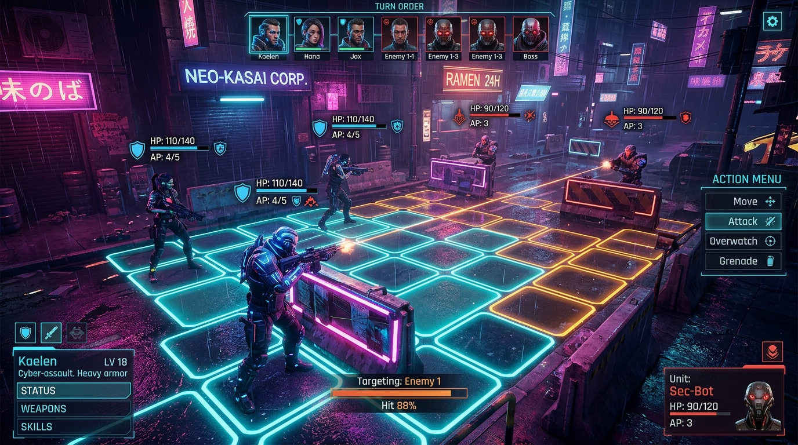
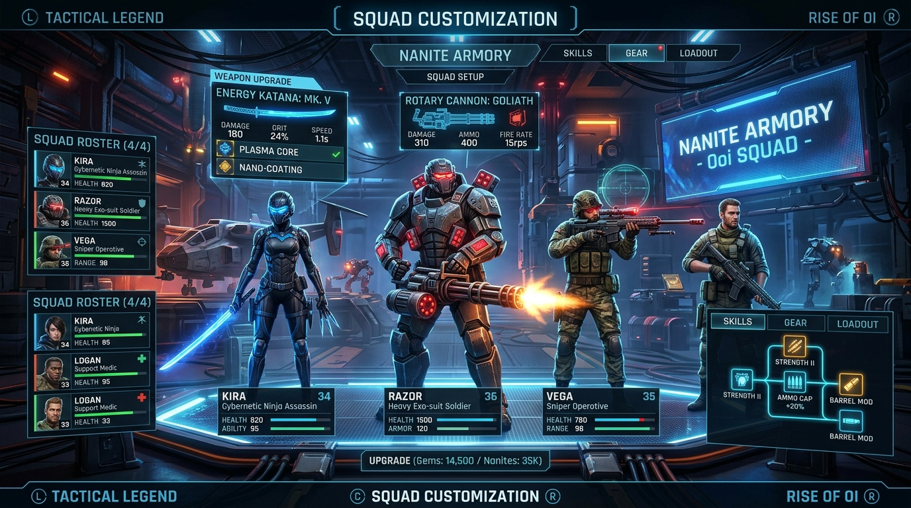
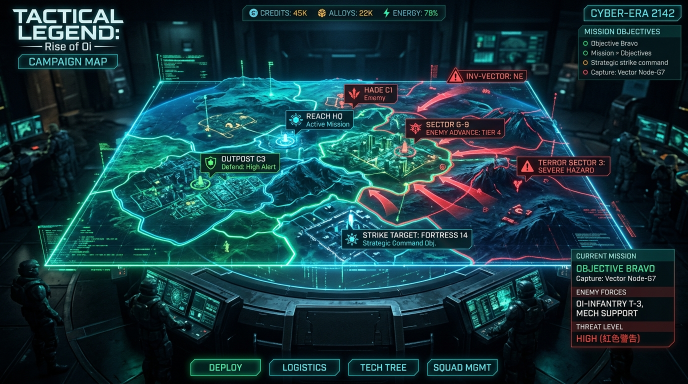
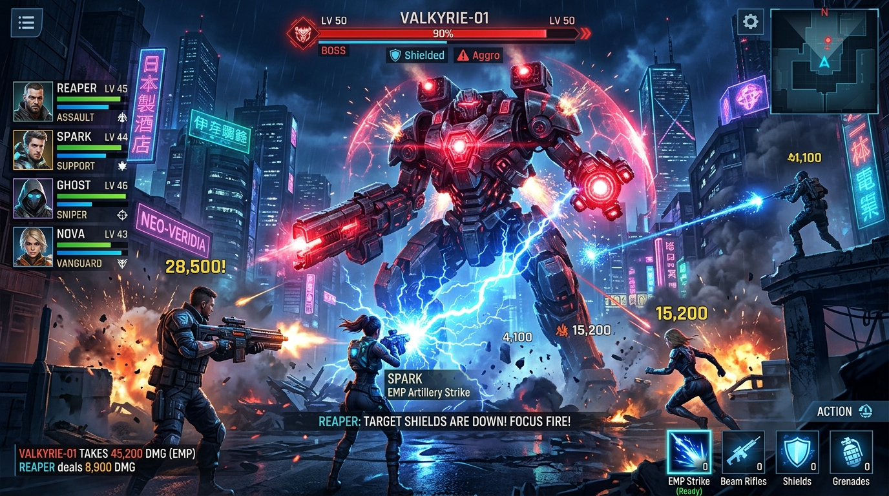

# Tactical Legend: Rise of Oi

<p align="center">
  
</p>

<p align="center">
  <strong>Next-Gen Cyberpunk Turn-Based Tactical RPG for Android</strong><br>
  Command an elite squad of cybernetic operatives across contested dystopian megacities, navigate isometric battle grids, hack corporate mainframe nodes, and dismantle rogue AI war titans.
</p>

---

## 🛡️ Security & OpenSSF Badges

[](https://bestpractices.dev/)
[](https://securityscorecards.dev/)
[](https://slsa.dev/)
[](https://openssf.org/)
[](https://openssf.org/)

[](https://developer.android.com/)
[](https://kotlinlang.org/)
[](https://developer.android.com/jetpack/compose)
[](https://m3.material.io/)

---

## 📱 Google Play Store Preview & Content Showcase

Explore the five core gameplay pillars and visual content featured on the Google Play Store:

### 1. Tactical Grid Combat & Attack Range Highlighting
Command your operatives on dynamic isometric battle grids with real-time turn tracking HUD, attack range heatmaps, targetable enemy highlights, and tactical cover bonuses.

<p align="center">
  
</p>

* **Turn Management HUD**: Visual indicators display active round number, AP gauge, and Player vs. Enemy phase banners.
* **Smart Attack Range Matrix**: Selected operatives dynamically project valid movement cells (cyan) and reachable enemy target cells (crimson reticles).
* **Cover & Flanking Mechanics**: Shield barriers provide defense boosts against kinetic and plasma projectiles.

---

### 2. Elite Operatives & Nanite Armory
Recruit, customize, and upgrade a specialized roster of cyber-soldiers, nanite-infused snipers, heavy exo-armor vanguards, and master netrunners.

<p align="center">
  
</p>

* **Modular Weapon Systems**: Equip plasma carbines, railgun sniper rifles, thermal blades, and EMP concussion launchers.
* **Cybernetic Augmentations**: Enhance operatives with kinetic dispersion weaves, reflex overclocking, and nanite regenerative filters.
* **Squad Synergies**: Coordinate class-specific passive bonuses for tactical superiority.

---

### 3. Holo Cinema & Tactical Recon Video Player Layout
Immerse yourself in high-tech surveillance briefings with custom video player layouts featuring dynamic aspect ratios (16:9, 21:9 ultrawide, 4:3 CRT), procedural scanlines, and audio frequency visualization.

<p align="center">
  
</p>

* **Adaptive Aspect Ratio Viewports**: Switch between cinematic widescreen, panoramic radar feeds, and retro surveillance monitors.
* **Interactive Briefing Scrubbing**: Jump between tactical mission chapters, review threat dossiers, and claim cyber credit rewards.
* **Cyber-Holographic HUD**: Live telemetry, tracking reticles, encrypted audio spectrums, and real-time mission telemetry.

---

### 4. Strategic Campaign Map & Global Sectors
Navigate contested megacity districts, deploy to high-risk strike zones, and reclaim planetary nodes from sovereign rogue machines.

<p align="center">
  
</p>

* **Interactive Sector Map**: Planetary holographic interface with contested boundary zones and threat rating heatmaps.
* **Pre-Mission Video Briefings**: Direct integration with the Video Player Layout for tactical pre-drop reconnaissance.
* **Resource Logistics**: Secure sector outposts to generate Nanite Alloys and Cyber Credits.

---

### 5. Epic Autonomous AI Titan Boss Raids
Engage towering autonomous war-engines and apex rogue AI constructs in multi-phase, high-stakes tactical showdowns.

<p align="center">
  
</p>

* **Multi-Part Targeting**: Disrupt energy shields, disable secondary plasma batteries, and breach the core processor.
* **Coordinated EMP Strikes**: Chain squad abilities to trigger critical vulnerability windows.
* **Dynamic Battlefield Hazards**: Dodge laser orbital sweeps, electrified floor conduits, and nanite swarm strikes.

---

## 🔒 OpenSSF & Security Practices

This project adheres to the security criteria established by the **Open Source Security Foundation (OpenSSF)**:

1. **Dependency Pinning & Version Catalog**: All Gradle dependencies and build plugins are strictly pinned in `gradle/libs.versions.toml` to guard against supply-chain poisoning.
2. **Least-Privilege Android Permissions**: Zero broad storage permissions (`READ_EXTERNAL_STORAGE` or `WRITE_EXTERNAL_STORAGE`). Only standard, vetted app permissions are declared.
3. **No Dynamic Code Loading (DCL)**: Executable code is completely self-contained; no remote classloaders, reflection exploits, or external `.dex`/`.so` payloads are permitted.
4. **Automated Static Analysis & Linter**: Continuous code sanity verification through automated compilation tools and Android Lint rules.
5. **Vulnerability Disclosure Policy**: Clear vulnerability reporting channels in compliance with OpenSSF Best Practices.

---

## 🚀 Architecture & Tech Stack

* **UI Framework**: Modern declarative UI with **Jetpack Compose 1.7+** and **Material 3 (M3)** dynamic theming.
* **State Management**: Reactive MVVM architecture using `ViewModel`, `StateFlow`, and `asStateFlow()`.
* **Sound Engine**: Custom low-latency Android `SoundPool` synthesizers via `SoundManager`.
* **Tactical Video Engine**: Custom `VideoPlayerLayout` with procedural CRT visualizer, chapter tracking, and aspect ratio transform controls.
* **Local Persistence**: Integrated data persistence for operative loadouts, mission progression, and cyber credits.

---

## 🛠️ Build & Installation

To build and run the application locally:

```bash
# Clone the repository
git clone https://github.com/westerveldjp/tactical-legend-rise-of-oi.git
cd tactical-legend-rise-of-oi

# Build debug APK
gradle :app:assembleDebug

# Run unit tests
gradle :app:testDebugUnitTest
```

---

<p align="center">
  <sub>Built with ❤️ using Android Jetpack Compose & Google AI Studio</sub>
</p>
